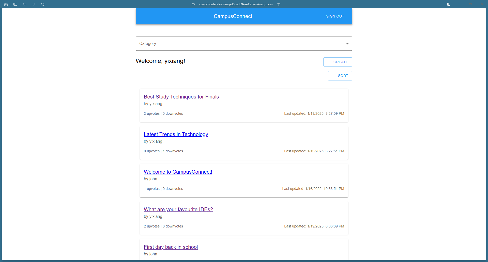
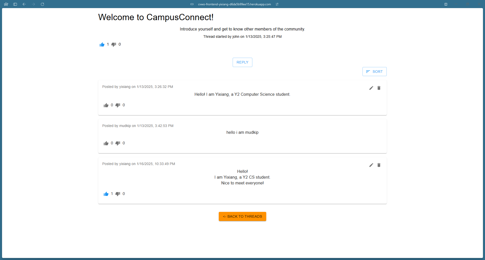

# CVWO Assignment (CampusConnect)

CampusConnect is a web forum application that allows users to create, view, edit and delete posts and comments within various categories. This project is built using a combination of MySQL and Go for the backend, and React and TypeScript for the frontend. The backend is responsible for handling API requests, interacting with the database, and managing the logic of the application.

## Author

Lim Yixiang

## Getting Started

### Running the app

1. Open CampusConnect by clicking on this [link](https://cvwo-frontend-yixiang-d6da5b99ee15.herokuapp.com/).
2. You should see a page like this.
    
3. Sign in to CampusConnect with a username of your choice.
4. Filter to any category of your choice to view related threads.
    
5. Click on the `Create` button to start a new thread.
6. Click on any interesting thread to reply or view comments.
    
7. You may choose to sort the chronological ordering of the threads or comments.

### Navigating the code

This is the main file structure

```
.
├── backend
│   ├── cmd
│   ├── internal
│   ├── Dockerfile
│   ├── go.mod
│   ├── go.sum
│   ├── heroku.yml
│   ├── Procfile
│   ├── README.md
│   └── server
├── build
├── node_modules
├── public
├── src
│   ├── components
│   ├── pages
│   ├── types
│   ├── App.css
│   ├── App.tsx
│   ├── backend.tsx
│   ├── index.css
│   ├── index.tsx
│   └── react-app-env.d.ts
├── .eslintignore
├── .eslintrc.js
├── .gitignore
├── .gitmodules
├── .prettierrc.js
├── package.json
├── Procfile
├── README.md
├── static.json
├── tsconfig.json
└── yarn.lock
```

## Acknowledgements

This project was bootstrapped with [Create React App](https://github.com/facebook/create-react-app).
This project uses [MUI](https://mui.com/),
[TypewriterJS](https://github.com/tameemsafi/typewriterjs#readme),
[ESLint](https://eslint.org/), [Prettier](https://prettier.io/).
